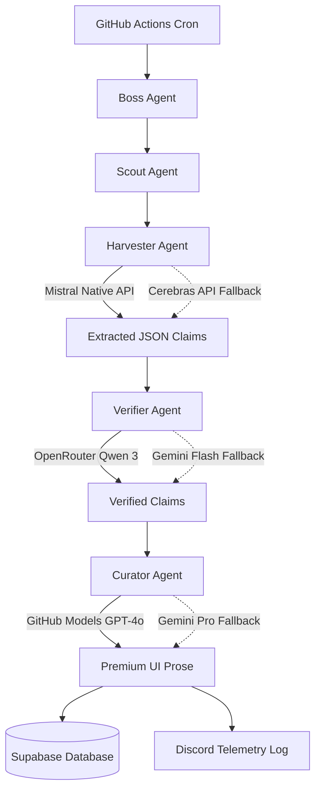

<div align="center">

# 🌌 Omni-Channel Tech Radar

**An Autonomous, Hierarchical Agentic Swarm & Command Center**

[](https://git.io/typing-svg)

[](#)
[](#)
[](#)
[](#)
[](#)
[](#)
[](#)

<br/>


</div>

<br/>

> **Omni-Channel Tech Radar** transcends the standard RSS reader. It is a highly-tuned, autonomous intelligence pipeline designed to ingest the noise of the modern web and distill it into high-fidelity, verified signal. By leveraging a decoupled, Hierarchical Agent Swarm via the Vercel AI SDK and a stunning Dual-Glassmorphism Next.js UI, it serves as a central command center for tracking the bleeding edge of technology.

---

## 🏗️ System Architecture: The Agentic Swarm

Our backend ingestion engine has been completely refactored from a monolithic script into a modular, fault-tolerant Agentic Swarm. It utilizes multi-LLM automated fallbacks and strict Zod schema parsing.



### The 5 Core Agents
* **👔 The Boss Agent:** The supervisor orchestrating the entire pipeline and tracking telemetry timings. Powered by Vercel AI SDK to manage execution chains and post Discord audits.
* **🔭 The Scout Agent:** The frontline recon unit using the NewsData.io API to fetch the latest breaking tech articles. It dynamically feeds global URLs into the processing queue.
* **🚜 The Harvester Agent:** The extraction engine using Spider Cloud to pull raw HTML and the Mistral Native API to extract strict JSON claims. Backed up by Cerebras Llama 3 for seamless failover.
* **🔎 The Verifier Agent:** The fact-checking powerhouse hitting the live web via DuckDuckGo Scrape. Powered by OpenRouter Qwen 3 to cross-reference claims, with Gemini as a fallback.
* **✍️ The Curator Agent:** The SaaS copywriter finalizing the prose. Driven by GitHub Models GPT-4o to format the content with Acorn typography and compute final Hype/Trust metrics.

---

## 🖥️ The Dashboard: Dual-Glassmorphism UI

The frontend is a serverless Next.js App Router application engineered for premium aesthetics:
- **Dual-Glassmorphism:** A seamless dark and light mode utilizing Tailwind `dark:` utility variants to transition from a bright `stone-50` backdrop to a deep `#0B0E14` cinematic canvas.
- **Acorn Typography:** Custom, bold typography ensuring superior editorial hierarchy across the dynamic Bento-grid cards.
- **Supabase Realtime:** Verified intelligence is committed to a Supabase PostgreSQL database using Row Level Security (RLS) and complex junction tables (`user_read_status`), giving every user their own personalized intelligence vault.

---

## 🔐 The API Key Vault (`.env.example`)

To run this enterprise-grade pipeline, configure these exact environment variables. 

```bash
# ==========================================
# FRONTEND VARIABLES (.env.local)
# ==========================================
NEXT_PUBLIC_SUPABASE_URL=
NEXT_PUBLIC_SUPABASE_ANON_KEY=

# ==========================================
# BACKEND SECRETS (GitHub Actions)
# ==========================================
SUPABASE_URL=
SUPABASE_SERVICE_ROLE_KEY=
DISCORD_LOG_WEBHOOK=
GROQ_API_KEY=
NEWSDATA_API_KEY=
MISTRAL_API_KEY=
OPENROUTER_API_KEY=
CEREBRAS_API_KEY=
GEMINI_API_KEY=
GH_MODELS_TOKEN=
SPIDER_API_KEY=
```

---

## 🛠️ Obtaining Your Credentials

Follow these quick instructions to automate the system and provision your keys completely free:

> [!TIP]
> **Supabase:** Dashboard -> Project Settings -> API (Copy URL, anon key, and service_role key). <br>
> **Discord Webhook:** Server Settings -> Integrations -> Webhooks -> New Webhook (Copy URL).

* **NewsData.io:** Register at [newsdata.io](https://newsdata.io) to receive 200 free daily calls for the Scout Agent.
* **Mistral AI:** Head to [console.mistral.ai](https://console.mistral.ai), add billing (not charged), and utilize the Free Experiment Tier for the primary Harvester.
* **OpenRouter:** Visit [openrouter.ai](https://openrouter.ai) to route to free Qwen 3 models for the Verifier Agent.
* **Cerebras:** Sign up for an API key to access ultra-fast inference for the Harvester fallback.
* **GitHub Models:** Go to your GitHub Settings -> Developer Settings -> Personal Access Tokens (Fine-grained). Create a token with **`models:read`** permissions and save it as your `GH_MODELS_TOKEN`.
* **Spider Cloud:** Register at [spider.cloud](https://spider.cloud) to provision your scraping API key.
* **Google Gemini:** Visit [Google AI Studio](https://aistudio.google.com/app/apikey) for free access to Gemini 1.5 Flash/Pro fallbacks.

---

## 🚀 Installation & Deployment

Deploying your local instance is straightforward:

```bash
# 1. Clone the repository
git clone https://github.com/sidd-harth830/News-Crawler.git

# 2. Install dependencies for the frontend dashboard
cd "News Crawler/frontend"
npm install

# 3. Spin up the Next.js development server
npm run dev
```

*Note: The backend engine runs autonomously in GitHub Actions. Be sure to configure your repository secrets via the Vault above before enabling the workflow!*
